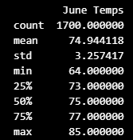
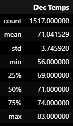

# Overview of the Analysis:

The purpose of this analysis is to provide key differences in weather between June and December in Oahu. This analysis will help W. Avy to determine if the surf and ice cream shop business is sustainable year-round.

## Results:

The temperature data for the months of June and December has been analyzed and the following are the key differences in weather between June and December:

### June Temperature Analysis:

The average temperature in June is around 75 degrees Fahrenheit, which is relatively high.
The minimum temperature in June is around 64 degrees Fahrenheit, while the maximum temperature is around 85 degrees Fahrenheit.
The standard deviation of temperature in June is around 3.26, which indicates that the temperature does not vary much during the month.

### December Temperature Analysis:

The average temperature in December is around 71 degrees Fahrenheit, which is relatively lower than June.
The minimum temperature in December is around 56 degrees Fahrenheit, while the maximum temperature is around 83 degrees Fahrenheit.
The standard deviation of temperature in December is around 3.75, which indicates that the temperature varies more during the month than in June.

## Summary:

In summary, the temperature data analysis suggests that the average temperature in June is relatively higher than in December. Additionally, the standard deviation of temperature is less in June than in December, which indicates that the temperature in June is more stable than in December.

### Further Analysis Recommendations:

To gather more weather data for June and December, we recommend the following two additional queries:

Precipitation Analysis:
To determine if the surf and ice cream shop business is sustainable year-round, it is important to analyze the precipitation data in June and December. High precipitation during these months could negatively impact the business. Hence, we recommend analyzing the precipitation data for the months of June and December.

Wind Analysis:
The strength and direction of wind can significantly impact the surf and ice cream shop business. Analyzing the wind data for the months of June and December can provide insights into the strength and direction of the wind, and whether it is favorable for the business.

Overall, analyzing the precipitation and wind data along with temperature data can provide a comprehensive understanding of weather trends in June and December, and help determine the sustainability of the surf and ice cream shop business year-round.
